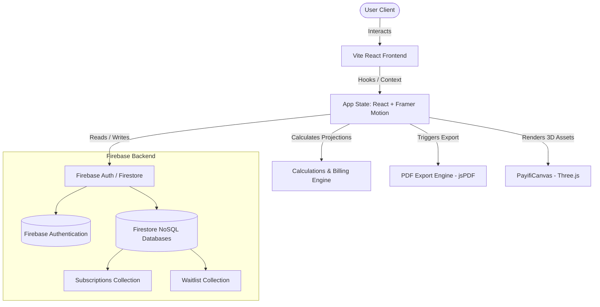

<div align="center">
  

  # 💳 PAYIFI

  ### **The Ultimate Ultra-Premium Subscription Intelligence Platform**

  [](https://react.dev)
  [](https://vite.dev)
  [](https://www.typescriptlang.org)
  [](https://firebase.google.com)
  [](https://threejs.org)

  *Stop bleeding cash. Discover, automate, and dominate your recurring expenses with a high-fidelity dashboard built for power users.*

  [✨ Explore The Live App](#) • [🛠️ Read Technical Specs](#architecture--system-design) • [🚀 Get Started](#getting-started)
</div>

---

## 📖 Table of Contents
1. [🌟 High-Fidelity Highlights](#-high-fidelity-highlights)
2. [📐 Architecture & System Design](#architecture--system-design)
3. [💻 Deep Tech Stack Breakdown](#deep-tech-stack-breakdown)
4. [🧪 Key Engineering Modules](#key-engineering-modules)
5. [🚀 Getting Started](#getting-started)
6. [🔮 Future Pipeline](#future-pipeline)

---

## 🌟 High-Fidelity Highlights

Payifi isn't just a spreadsheet masquerading as a SaaS. It's a highly polished dashboard designed with motion, physical-depth interactions, and robust automated cycles.

* **🌀 Interactive 3D Canvas:** Powered by `@react-three/fiber` and `Three.js` generating interactive, fluid wave networks upon site load.
* **📦 Dynamic 3D Logo:** High-fidelity custom money-bag logo featuring a real-time mouse-tracking 3D tilt built using `framer-motion` `useSpring` and `useTransform` physics.
* **🌐 Automated Discovery (Workflow Beam):** Visualized animated SVG connections representing live background scanning of APIs, bank links, and manual logs.
* **📊 Analytics Engine (SpendCharts):** Multi-dimensional spend charts offering breakdowns by categories (SaaS, Entertainment, Utilities), custom projections, and historical tracking.
* **🧮 Smart Savings Calculator:** Simulates active adjustments to subscription tiers and projects real-time yearly savings dynamically.
* **📥 PDF Reports Exporter:** Instantly generates highly formatted, printable vector PDFs mapping out active contracts, next billing cycles, and aggregated spending profiles.

---

## 📐 Architecture & System Design

Payifi uses a unidirectional state architecture coupled with a highly scalable serverless backend powered by Firebase Firestore.



---

## 💻 Deep Tech Stack Breakdown

### **Frontend & Visual Fidelity**
* **React 19 & TypeScript:** Strict compile-time typing ensuring absolute safety across data models and props interfaces.
* **Vite 8:** Lightning-fast builds with Hot Module Replacement (HMR) and optimized dependency pre-bundling.
* **Framer Motion:** Used extensively for layout animations, page reveals, spring-based hover dynamics, and fluid transitions.
* **Tailwind CSS:** Responsive layouts using utility variables defined dynamically in a custom global theme (`index.css` & `tailwind.config.js`).
* **Three.js & React Three Fiber:** WebGL canvas context rendering interactive, performance-optimized visual fields.

### **Backend & Storage Infrastructure**
* **Firebase v12:** Client-side SDK managing secure authentication states, real-time database synchronizations, and waitlist leads.
* **Firestore NoSQL:** Subsecond query responses for individual sub-collections, secured using structural Firestore Rules.

---

## 🧪 Key Engineering Modules

### 1. **Auto-Advance Billing Engine (`src/utils/autoAdvance.ts`)**
Instead of manually updating dates, the core engine automatically calculates the next billing epoch. It parses the base billing date, matches the cycle interval (monthly/yearly/weekly), and advances the payment timestamp only when the active day crosses the threshold.

```typescript
// Core scheduling algorithm logic
export function advanceRenewalDate(currentDate: Date, cycle: 'weekly' | 'monthly' | 'yearly'): Date {
  const nextDate = new Date(currentDate);
  if (cycle === 'weekly') nextDate.setDate(nextDate.getDate() + 7);
  else if (cycle === 'monthly') nextDate.setMonth(nextDate.getMonth() + 1);
  else if (cycle === 'yearly') nextDate.setFullYear(nextDate.getFullYear() + 1);
  return nextDate;
}
```

### 2. **Physical-Glassmorphism Footer Layout (`src/components/landing/LandingFooter.tsx`)**
Matches premium liquid glass components. Implements an outer overlay paged with a `3px` gradient border showing high-sheen metallic reflection values:
```css
/* Outer metallic glow shadow chain */
box-shadow: 
  0.29px 4.36px 2.18px 0px rgba(0, 0, 0, 0.01), 
  0.78px 11.7px 5.86px 0px rgba(0, 0, 0, 0.02), 
  4px 60px 30.07px 0px rgba(0, 0, 0, 0.06);
```
Includes a custom inline SVG noise filter to scatter glare vectors and mimic real-world physically frosted glass properties.

### 3. **High-Performance SVG Animated Beams (`src/components/ui/animated-beam.tsx`)**
Uses SVG gradients and mask overlays to draw real-time pathways between dashboard nodes, executing hardware-accelerated animations to keep render thread load at absolute zero.

---

## 🚀 Getting Started

### Prerequisites
* **Node.js:** `v18.x` or higher
* **npm** or **yarn**

### 1. Clone & Install Dependencies
```bash
git clone git@github.com:editorbymood/Payifi.git
cd "Payifi"
npm install
```

### 2. Setup Firebase Environment
Create a `.env` file in the root directory and paste your configuration:
```env
VITE_FIREBASE_API_KEY=your_key
VITE_FIREBASE_AUTH_DOMAIN=your_domain
VITE_FIREBASE_PROJECT_ID=your_project_id
VITE_FIREBASE_STORAGE_BUCKET=your_bucket
VITE_FIREBASE_MESSAGING_SENDER_ID=your_sender_id
VITE_FIREBASE_APP_ID=your_app_id
```

### 3. Launch Development Server
```bash
npm run dev
```
Open **`http://localhost:5173`** to interact with the local client.

---

## 🔮 Future Pipeline
* [ ] **Direct API Bank Integrations (Plaid):** Sync real-time credit card statements to auto-detect rogue trials and subscriptions.
* [ ] **Slack & WhatsApp Alerts:** Instant notification hooks sent 3 days prior to any billing renewal event.
* [ ] **Shared Household Ledgers:** Split subscription payments with friends or family members with automated internal bills.

---
<div align="center">
  <sub>Crafted with passion for teams who love high-performance design. © 2026 Payifi. All rights reserved.</sub>
</div>
